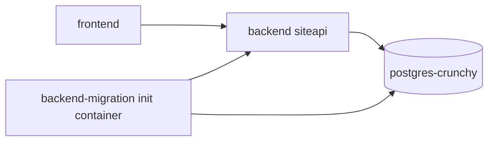
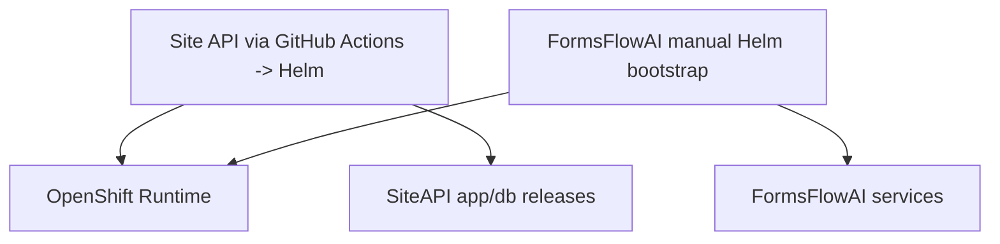
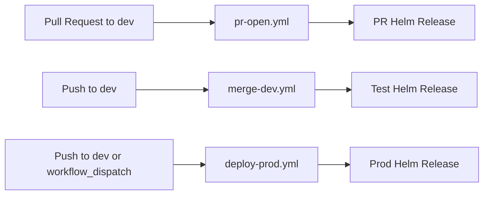
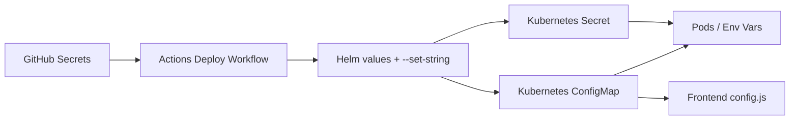

# Master DevOps Documentation

## What Is Deployed Today
This repo deploys through reusable GitHub Actions workflows and Helm charts, not raw OpenShift template files.

- App deploy workflow: `.github/workflows/.deployer.yml`
- Database deploy workflow: `.github/workflows/.dbdeployer.yml`
- PR entry workflow: `.github/workflows/pr-open.yml`
- Test entry workflow: `.github/workflows/merge-dev.yml`
- Prod entry workflow: `.github/workflows/deploy-prod.yml`
- App chart: `charts/app`
- Database chart: `charts/crunchy`

Primary runtime components:
- `backend` (service/API, package name `siteapi`)
- `frontend` (web app)
- `backend-migration` (init/migration image)
- `postgres-crunchy` (Crunchy Postgres Operator resources)



## Two Co-existing DevOps Approaches
There are two parallel approaches currently co-existing:

### 1) Site API / Quickstart-style approach
- Workflow patterns are based on reusable quickstart-style helpers (`action-builder-ghcr`, `action-diff-triggers`, `action-get-pr`, quickstart validation action).
- Helm-first deployment model for app and DB (`charts/app`, `charts/crunchy`).
- Helm deployment is executed from GitHub Actions workflows (`pr-open.yml`, `merge-dev.yml`, `deploy-prod.yml`) through reusable deploy workflows.
- PR -> ephemeral release, then promotion to test/prod through workflow triggers.

### 2) FormsFlowAI-aligned integration approach
- Runtime auth and identity integration uses `forms-flow-ai` Keycloak realm conventions in `charts/app/values*.yaml`.
- Frontend runtime config points to platform services aligned with that ecosystem (Keycloak/COMS endpoints).
- FormsFlowAI services are initially deployed manually with Helm (outside the always-on Site API GitHub Actions deploy path), then co-exist with Site API runtime integration.



## Environment and Promotion Flow
Current promotion behavior:

- PRs targeting `dev` run `.github/workflows/pr-open.yml`
- Pushes to `dev` run `.github/workflows/merge-dev.yml` (test deployment)
- Prod deploy runs from `.github/workflows/deploy-prod.yml` on push to `dev` or manual `workflow_dispatch`

Tag/release behavior from `.github/workflows/.deployer.yml`:
- PR deploy tag defaults to PR number.
- Release name format is `${repo}-${environment-or-pr}`.
- Prod uses explicit `tag` input when provided, else defaults to `prod`.



## Deployment Mechanics (Site API Only: Helm + OpenShift)
Site API deployment (`.github/workflows/.deployer.yml`):
- Logs into OpenShift with short-lived token derived from `OC_TOKEN`.
- Packages chart and runs `helm upgrade --install --wait --atomic`.
- Injects runtime values and secrets via `--set-string` and values files.
- Uses `action-diff-triggers` to avoid unnecessary deploys.
- Includes PR handling for previous pending Helm release status.

Site API database deployment (`.github/workflows/.dbdeployer.yml`):
- Deploys/updates Crunchy resources via `helm upgrade --install`.
- Optionally injects S3 backup secrets for pgBackRest.
- Verifies DB readiness and manages DB users (including PR-specific users).

Cleanup (`.github/workflows/.pr-close.yml`):
- Removes Helm release for closed PR environments.
- Removes PR-specific DB users/databases in Crunchy.

## Secrets and Configuration Flow
Primary path:
- GitHub Actions secrets are injected during workflow execution.
- Deploy workflows pass secret values into Helm (`--set-string` and values files).
- Helm renders Kubernetes/OpenShift `Secret`, `ConfigMap`, and workload env/mounts.

FormsFlowAI runtime config:
- Frontend runtime environment values (not secrets!) are emitted into `config.js` by the frontend ConfigMap template.

Key file map:
| Step | File | Why it matters |
|---|---|---|
| Site API secret injection at deploy time | [`../.github/workflows/.deployer.yml`](../.github/workflows/.deployer.yml) | Source of `--set-string` secret wiring |
| DB secret injection for Crunchy deploy | [`../.github/workflows/.dbdeployer.yml`](../.github/workflows/.dbdeployer.yml) | Injects backup/DB-related secret values |
| Chart secret materialization | [`../charts/app/templates/secret.yaml`](../charts/app/templates/secret.yaml) | Converts chart values into Kubernetes secrets |
| Frontend runtime `config.js` | [`../charts/app/templates/frontend/templates/configmap.yaml`](../charts/app/templates/frontend/templates/configmap.yaml) | Generates runtime config consumed by frontend |
| Default expected keys | [`../charts/app/values.yaml`](../charts/app/values.yaml) | Canonical key names and defaults |



## Environment Drift and Candidates for Deletion
Snapshot basis:
- Analysis below is based on the appended `oc get all -n e38158-dev|test|prod -o wide` outputs in this document.
- Date context: February 23, 2026.
- Rule used: anything clearly active/running is not listed as a deletion candidate.

### e38158-dev
High-confidence candidates for deletion:

*The "analytics" services were used at one time, but no longer. They're for analytic report generation*
- `deployment.apps/forms-flow-analytics-adhoc-worker` (`0/0`, ~2y296d)
- `deployment.apps/forms-flow-analytics-scheduled-worker` (`0/0`, ~2y296d)
- `deployment.apps/forms-flow-analytics-scheduler` (`0/0`, ~2y296d)
- `deployment.apps/forms-flow-analytics-server` (`0/0`, ~2y296d)
- `deployment.apps/forms-flow-analytics-worker` (`0/0`, ~2y296d)
- `deployment.apps/forms-flow-data-analysis` (`0/0`, ~3y44d)

*Unsure whose these are, what they are*
- `deployment.apps/workspace0e76c47881db42cb` (`0/0`, ~98d)
- `deployment.apps/workspace804471b24af54aaa` (`0/0`, ~185d)

*Moved to forms-flow-ai-postgresql*
- `deployment.apps/postgres-crunchy-pgbouncer` (`0/0`, ~100d)
- `statefulset.apps/postgres-crunchy-db-2tdx` (`0/0`, ~100d)
- `statefulset.apps/postgres-crunchy-db-v52q` (`0/0`, ~100d)
- `statefulset.apps/postgres-crunchy-repo-host` (`0/0`, ~100d)


- Preview-style releases `nr-epd-digital-services-1029-*`, `nr-epd-digital-services-1034-*`, `nr-epd-digital-services-1230-*` (mixed health). Delete only if corresponding PR/release is closed and no longer needed. There have been issues of cleanup not always working, but this is based on nr-qs scripts. It's always safe to nuke a pr environment and then close/re-open pr.
- Large volume of old `replicaset.apps/*` entries at `0/0` is normal history, but retention appears high and should be pruned deliberately.

### e38158-test

Investigate before deletion:
- Some old database instances exist and can likely be deleted, current source of truth is `forms-flow-ai-postgresql`, with old ones being `patroni-standalone`, and `postgres-crunchy-*`. To change, simply change `DATABASE_SERVICE_NAME` in https://console.apps.silver.devops.gov.bc.ca/k8s/ns/e38158-test/configmaps/forms-flow-ai and then restart all servivces.

### e38158-prod
High-confidence candidates for deletion:
- We migrated dev and test over from DeploymentConfigs to Deployments, and have done same for almost all services in prod. However, we never deleted the DeploymentConfigs in prod in case an immediate rollback was required, though they're good candidates for deletion now. Only 3 still remain, `epd-backend-applications`, `epd-backend-users`, `epd-frontend`.
- DeploymentConfigs (NOT DEPLOYMENTS, but DEPLOYMENTCONFIGS!) with `DESIRED=0` and `CURRENT=0`:
`bcbox`, `common-object-management-service-coms`, `epd-database`, `epd-database-backup`, `epd-keycloak`, `epd-keycloak-backup`, `forms-flow-bpm-ee`, `forms-flow-nav`, `forms-flow-theme`, `forms-flow-web-ee`, `forms-flow-web-root-config`, `keycloak-db`, `keycloak-db-backup`.
- `route.route.openshift.io/common-object-management-service-coms-patroni-mk2` (`HostAlreadyClaimed`).

Investigate before deletion:
- `deployment.apps/epd-database` (`0/0`) and `deployment.apps/epd-frontend` (`0/0`) appear legacy; verify no remaining consumers/routes depend on them.
- `deployment.apps/forms-flow-analytics-server` (`0/0`) and `deployment.apps/forms-flow-data-analysis` (`0/0`) are disabled, also candidate for deletion along with all analytics. 

Deletion sequencing recommendation:
1. Remove stale routes and stale zero-scaled DeploymentConfigs first.
2. Remove zero-scaled legacy Deployments next.
3. Remove unused DB stacks last, only after dependency and backup checks.


## Component Deployment Matrix

| Component family | Delivery approach | Dev | Test | Prod |
|---|---|---|---|---|
| Site API runtime (`nr-epd-digital-services-*`) | GitHub Actions -> Helm | Active, with some drift and unhealthy preview backends | Active | Active |
| Legacy EPD stack (`epd-*`) | Legacy/manual/history | Mixed: some active, some failed/zero-scaled | Mixed | Mixed, many zero-scaled DeploymentConfigs |
| FormsFlowAI core (`forms-flow-*`, `forms-flow-ai-*`) | Manual Helm bootstrap, with GitHub Actions to deploy new images | Active | Active | Active |
| Database planes (Crunchy, Patroni, FormsFlow Postgres) | Mixed operators/charts | Multiple DB stacks present | Multiple DB stacks present | Multiple DB stacks present |


## Fixing Hung Helm Installs
Problem pattern:
- A GitHub Actions deployment run is cancelled/stopped mid-upgrade.
- Helm release is left in a pending state and the next deploy can fail or hang.
- In this repo, release names are generated in `.github/workflows/.deployer.yml` as `${repo}-${environment-or-pr}`.

Use this process per namespace/release.

1. Identify the release and inspect status.

```bash
# Examples:
# PR:   nr-site-registry-1234
# TEST: nr-site-registry-test
# PROD: nr-site-registry-prod
RELEASE=<release-name>
NS=<namespace>

helm list -n "$NS" -a | rg "$RELEASE"
helm status "$RELEASE" -n "$NS" || true
```

2. List Helm release secrets and find pending revisions.

```bash
oc get secret -n "$NS" -l owner=helm,name="$RELEASE" \
  -o custom-columns='NAME:.metadata.name,STATUS:.metadata.labels.status,REV:.metadata.labels.version,CREATED:.metadata.creationTimestamp'
```

3. Delete only the stuck pending Helm secrets for that release.

```bash
oc delete secret -n "$NS" \
  -l 'owner=helm,name='"$RELEASE"',status in (pending-install,pending-upgrade,pending-rollback)'
```

4. If no selector match, delete specific stuck secret(s) by name after review.

```bash
oc delete secret -n "$NS" <helm-release-secret-name>
```

5. Re-run deployment and verify recovery.

```bash
helm list -n "$NS" -a | rg "$RELEASE"
helm status "$RELEASE" -n "$NS"
oc get deploy -n "$NS"
```

Notes:
- Do not delete secrets with `status=deployed` for an active release.
- Always scope deletions to one release (`name=<release>`) and one namespace.

## TODO
- Add a GitHub Actions health section to review which workflows are active, disabled, failing, flaky, or obsolete.
- Verify runbook for fixing helm installs, still wip.