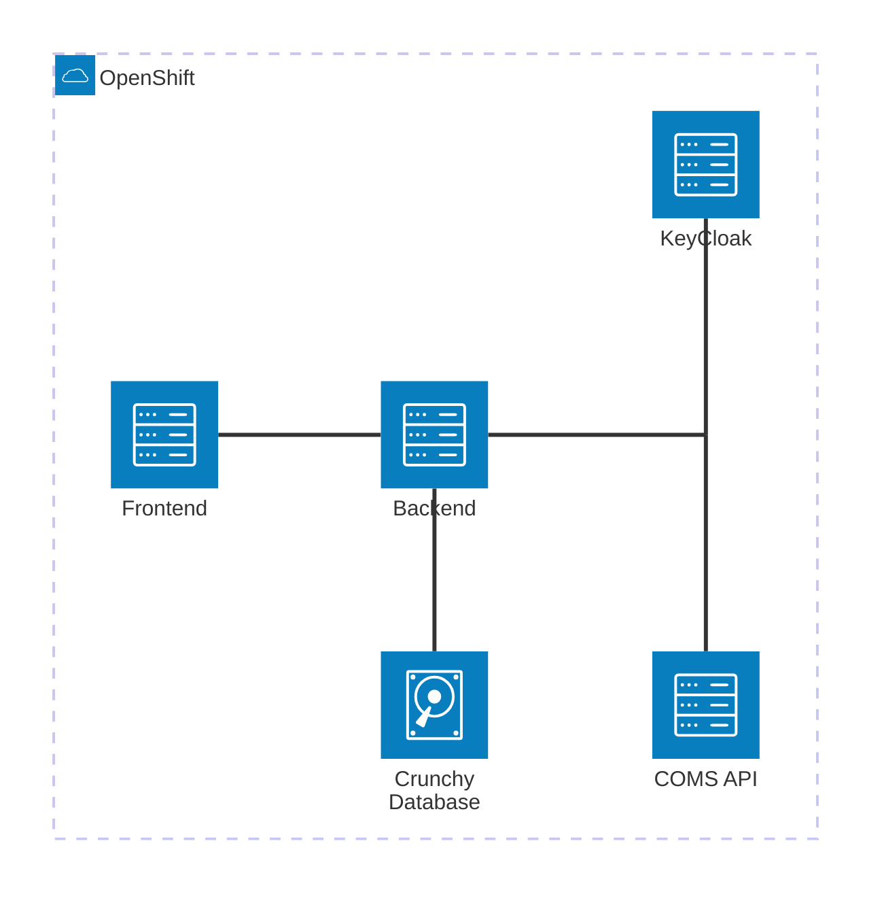
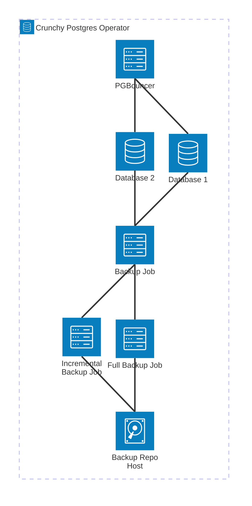
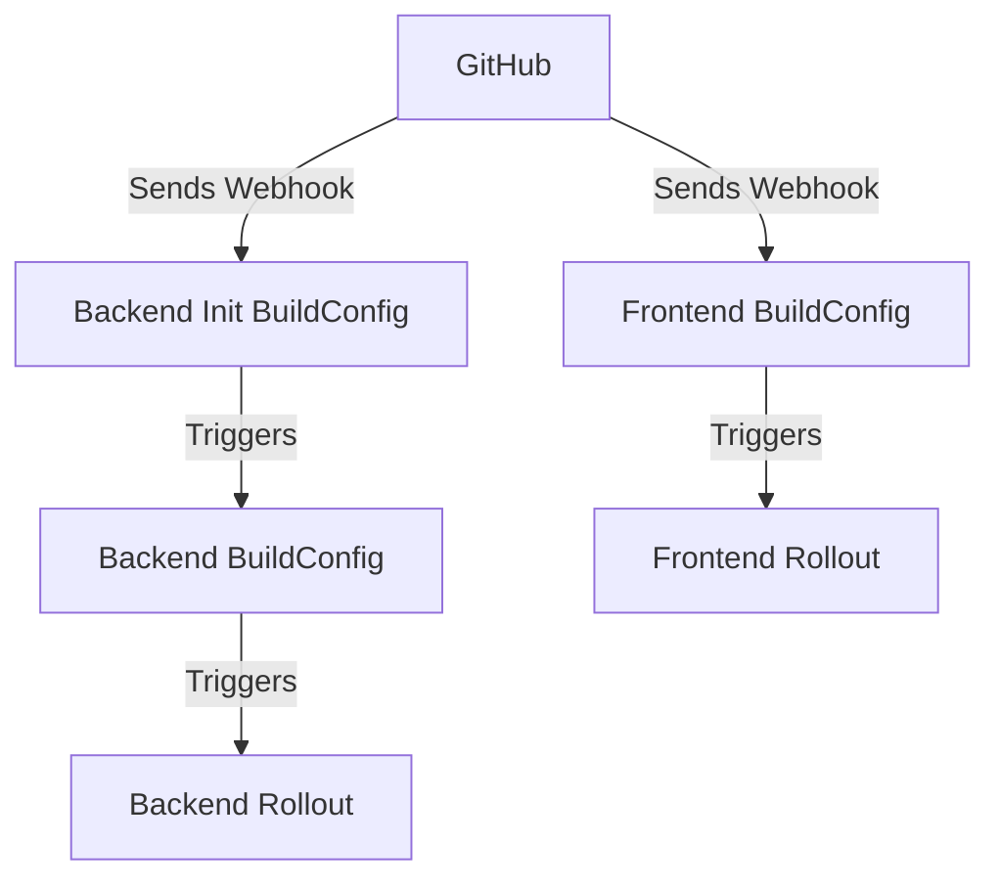

# OpenShift Operations Manual

The purpose of this document is to give an overview of how all of the SITE
Registry's services relate to one another, how to deploy them to a new OpenShift
namespace, and maintain them.

## Overview



### Front End and Back End Common features

#### Deployment

This is the entity that controls the actual pods that execute the actual code.

#### Horizontal Pod Autoscaler

Configures how the deployment should respond when it is under load. Horizontal
means that rather than throw more compute and memory at the pods (that would be
vertical scaling), it will create more pods to handle tasks in parallel. It
seems unlikely that we will experience much traffic so we can use a modest
configuration.

#### Pod Distruption Budget

This configures how the deployment responds to disruptions. It allows you to
select a minAvailable or maxUnavailable value. It is important to compare this
value to the number of pods that the deployment is targeting. If the PDB has a
minAvailable of 1, and the deployment targets 1 pod, then it is impossible to
restart the pod. For our use

#### Configuration

##### Config Map

This is used to inject environment variables, not the secret ones, into each
pod's execution environment.

##### Secrets

Defines what sensitive data is required. You'll either need to enter the secret
data directly through the web console, or use the `oc` tool.

#### Networking

Taken together the following three entities define how network traffic can flow
through the OpenShift cluster.

```
Internet -> Ingress -> Service -> Pods
                    ^
Network Policy enforces whether the caller
is allowed to reach the service/pod.
```

Note: Ingresses apply to HTTP(S) traffic only. All other traffic can ingress and
will be subject to the NetworkPolicy.

##### Ingress

This defines how network traffic is allowed into the OpenShift cluster from
outside..

##### Service

This defines the internal network of the openshift cluster. It provides internal
DNS and load balancing when directing network traffic to pods.

##### Network Policy

Kubernetes Network Policy. It provides rules for which network traffic is, and,
is not allowed. Very similar to a firewall, it takes both the caller, and
receiver into account when applying rules.

### Backend specific entities

### Database

#### The Crunchy Postgres Operator

We don't really have any control over this because it's an openshift operator,
but for troubleshooting purposes, here is how it works.



In most cases, you want to route all database requests to the PGBouncer server.
There are some cases where there are known issues with PGBouncer (Prisma's
database migrator for example), and you will need to specify an alternate
connection directly to the primary database, for migrations only.

You can directly access the database by accessing a remote shell with
`oc -n <namespace> rsh pod/postgres-crunchy-db-<random-four-digit-code>` and run
a `psql` shell from there. Please do not do this in prod.

See the Devops handbook in confluence for more specific and advanced database
troubleshooting techniques.

#### PostgresCluster

This is the definition for the database. Note how it uses the Crunchy Postgres
Operator in the apiVersion.

#### ConfigMap

Defines the database configuration when it is first started.

#### KNP

Kubernetes network policy. Permits network traffic from the backend pod to the
database.

#### PGBackRest Log Rotator

This is a job designed to address an
[upstream bug.](https://github.com/CrunchyData/postgres-operator/issues/4142)
where the database's storage will fill with hundreds of megabytes of logs. It
simply rotates the logs rather than allowing them to accumulate.

#### Database Seeding

There is information in `backend/cats/openshift-upload-db`

## Operation

Put stuff here that describes how to deploy/redeploy the services.

Deploy steps short version:

1. Apply Imagestreams and BuildConfigs
   1. Apply the ImageStreams and BuildConfigs to the tools namespace.
   2. Run all of the builds to push images.
2. Deploy the database
   1. Apply ConfigMap, NetworkPolicy, Secret
   2. Fill out the secret values (TODO: come up with a way to share these)
   3. Apply PostgresCluster
   4. Wait for the PostgresCluster to come up (It takes ~10min)
   5. Apply and Copy the initialization files to the PVC
   6. Apply and Run the database init Job.
3. Deploy the backend
   1. Apply the PodDisruptionBudget, HorizontalPodAutoscaler, Service, Ingress,
      and Secret
   2. Fill out the secret values
   3. Apply the Deployment
   4. Apply the ESRA CSV cronjob
4. Deploy the frontend
   1. Apply the PodDisruptionBudget, HorizontalPodAutoscaler, Service, Ingress,
      and ConfigMap
   2. Apply the Deployment

### Create ImageStreams and BuildConfigs

For the curious: the lookupPolicy is whether or not the images in the
ImageStream can be referenced by their name. Since we'll be building and using
the images in different namespaces we need to fully qualify the URIs for the
images and turning on the local lookupPolicy will not help us.

1. Build the image for the container that will run the database initialization
   script.

   The scripts needs to be run in an environment that has both node and the
   postgresql client installed, so we'll build images specifically for that.

   ```sh
   oc -n c6a6e5-tools apply -f ./openshift/site_registry/tools/site_postgres_cluster_db_init_build_config.yaml
   oc -n c6a6e5-tools apply -f ./openshift/site_registry/tools/site_backend_init_build_config.yaml
   oc -n c6a6e5-tools apply -f ./openshift/site_registry/tools/site_backend_build_config.yaml
   oc -n c6a6e5-tools apply -f ./openshift/site_registry/tools/site_frontend_build_config.yaml
   ```

   They also needs an ImageStreams to push to:

   ```sh
   oc -n c6a6e5-tools apply -f ./openshift/site_registry/tools/site_postgres_cluster_db_init_image_stream.yaml
   oc -n c6a6e5-tools apply -f ./openshift/site_registry/tools/site_backend_init_image_stream.yaml
   oc -n c6a6e5-tools apply -f ./openshift/site_registry/tools/site_backend_image_stream.yaml
   oc -n c6a6e5-tools apply -f ./openshift/site_registry/tools/site_frontend_image_stream.yaml
   ```

   Run the build to push the initialization image into the imagestream.

   ```sh
   oc -n c6a6e5-tools start-build site-postgres-cluster-db-init
   oc -n c6a6e5-tools start-build site-backend-init
   oc -n c6a6e5-tools start-build site-backend
   oc -n c6a6e5-tools start-build site-frontend
   ```

### Bootstrapping the Database

See `ora2pg/README.md` for information about how to bootstrap the database.

### Deploying the Backend

1. Apply the configuration files.

   ```sh
   oc apply -f ./openshift/site_registry/dev/backend/site_backend_horizontal_pod_autoscaler.yaml
   oc apply -f ./openshift/site_registry/dev/backend/site_backend_pod_disruption_budget.yaml
   oc apply -f ./openshift/site_registry/dev/backend/site_backend_service.yaml
   oc apply -f ./openshift/site_registry/dev/backend/site_backend_ingress.yaml
   ```

2. Apply and fille out the secret.

   ```sh
   oc apply -f ./openshift/site_registry/dev/backend/site_backend_secret.yaml
   ```

   Then go and fill out the values.

3. Launch the deployment.

   ```sh
   oc apply -f ./openshift/site_registry/dev/backend/site_backend_deployment.yaml
   ```

   That's all there is to it!

4. Install the CSV syncronization job

   This job is part of the ESRA integration. We generate and upload a CSV file
   to object storage every night which is used to synchronize site data to other
   systems.

   ```sh
   oc apply -f ./openshift/site_registry/dev/backend/site_backend_esra_csv_cronjob.yaml
   ```

### Deploying the Frontend

1. Apply the configuration files.

   ```sh
   oc apply -f ./openshift/site_registry/dev/frontend/site_frontend_horizontal_pod_autoscaler.yaml
   oc apply -f ./openshift/site_registry/dev/frontend/site_frontend_pod_disruption_budget.yaml
   oc apply -f ./openshift/site_registry/dev/frontend/site_frontend_service.yaml
   oc apply -f ./openshift/site_registry/dev/frontend/site_frontend_ingress.yaml
   oc apply -f ./openshift/site_registry/dev/frontend/site_frontend_config_map.yaml
   ```

   The frontend has no secrets. Everything in the configmap gets sent to the
   browser.

2. Launch the deployment.

   ```sh
   oc apply -f ./openshift/site_registry/dev/frontend/site_frontend_deployment.yaml
   ```

### Configuring Automatic Deploys to Dev

The BuildConfigs are set to trigger on a webhook from github. In order to
configure this webhook, you need to apply and create the webhook secret:

```sh
oc -n c6a6e5 apply -f ./openshift/site_registry/tools/site_webhook_secret.yaml
# this is what I used to generate the secret:
openssl rand -hex 24
```

Now go to the GitHub repo settings and add the webhook with the generated
secret. If you look at the BuildConfig in OpenShift, you can see, and copy, the
URL that will receive the webhook.

The automatic deploy procedure goes like this:

1. Github issues a webhook to trigger the `site-backend-init` BuildConfig

   1. The `site-backend-init` build completes, which triggers a new build of the
      `site-backend` BuildConfig. See the `site-backend` BuildConfig for the
      ImageStreamTag-based trigger.
   2. The `site-backend` build completes, which triggers a new rollout of the
      `site-backend` deployment. See the Deployment for the
      `image.openshift.io/triggers`-based trigger. This annotation trigger
      **must** be specified in a single line. A multi-line definition will fail.

2. GitHub issues a webhook to trigger the `site-frontend` Buildconfig
   1. The `site-frontend` build completes, which triggers a new rollout of the
      `site-frontend` Deployment. It is configured in the same way as the
      backend deployment mentioned above.



### Configuring Promotion From Dev to Test, and Test to Prod.

There are two pipeline manifests in `openshift/site_registry/tools` named
`site_promote_dev_to_test_pipeline.yaml` and
`site_promote_test_to_prod_pipeline.yaml`. The easiest way to access these is
through the OpenShift console in developer mode. It'll be in the main menu, and
you can run the pipeline from there.

The pipelines just tag the current `:dev` images with `:test` and `:test` images
with `:prod` respectively. The deployments in each environment should have
trigger annotations that look for these tags and automatically rebuild and
rollout.
